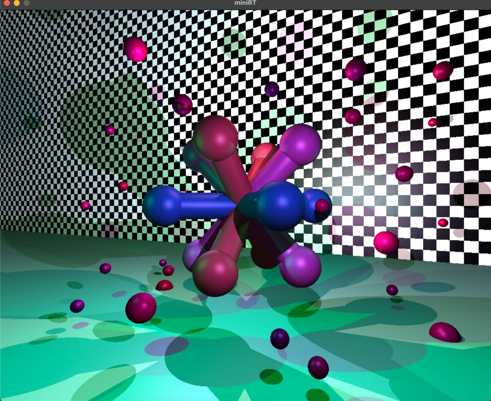
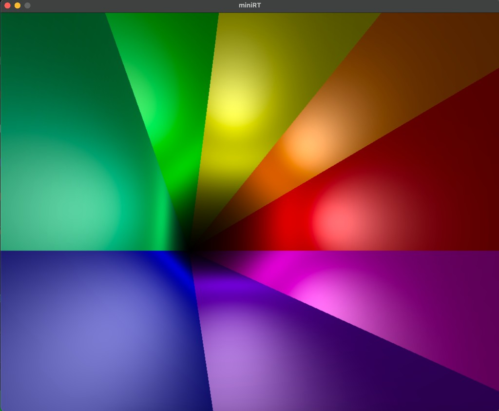
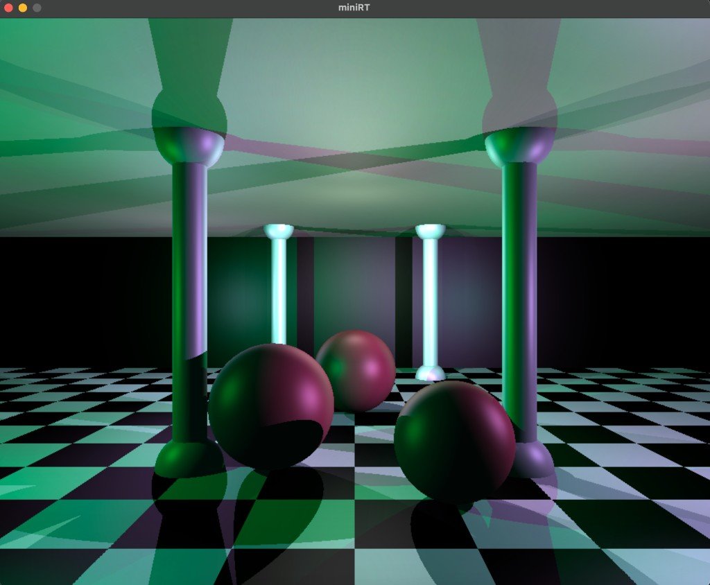
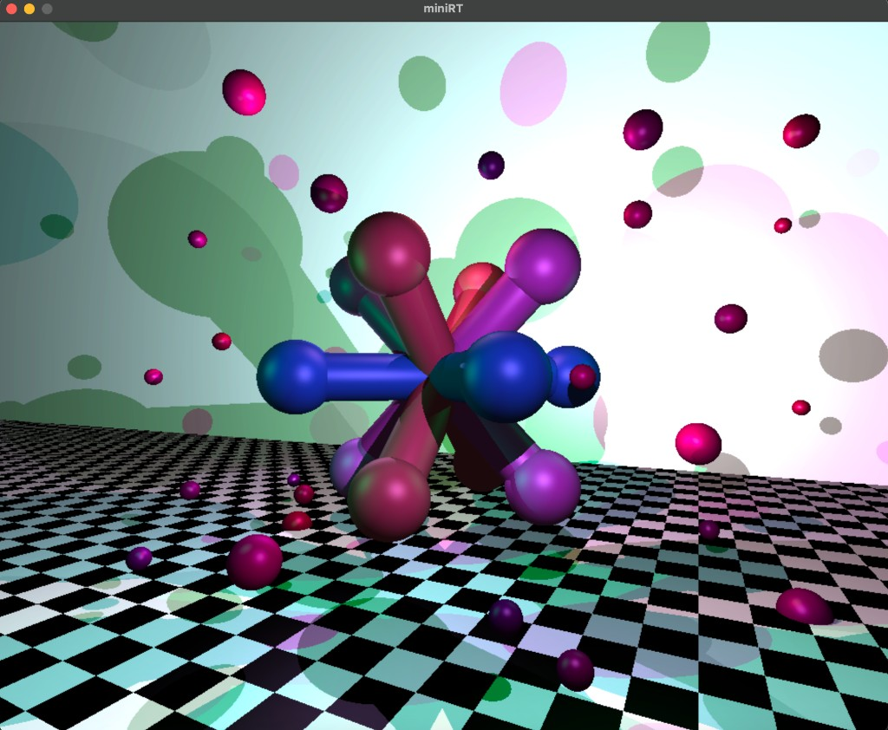
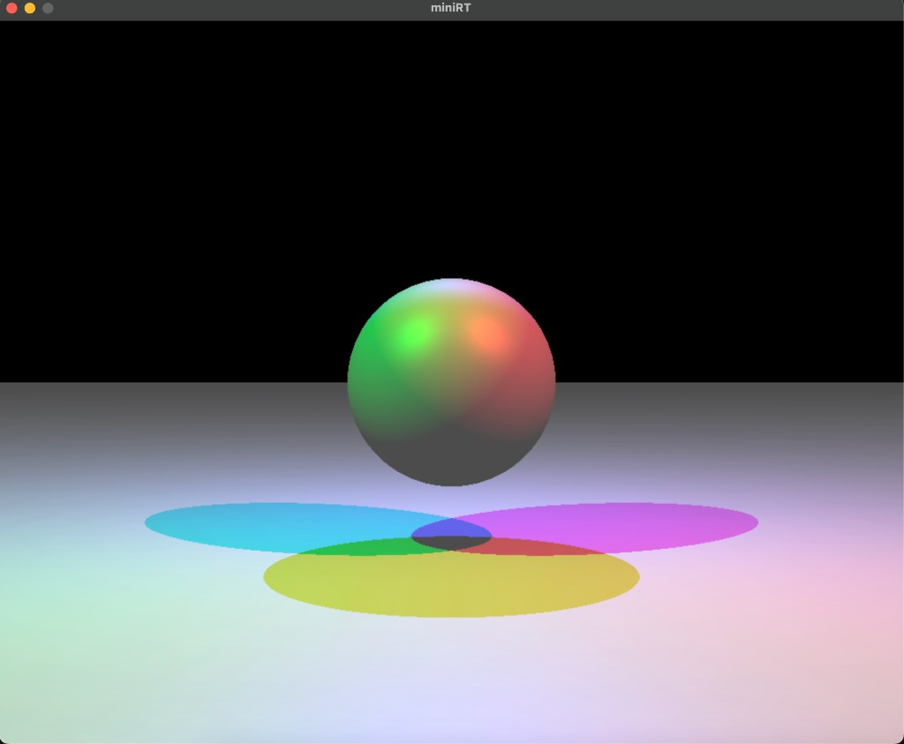
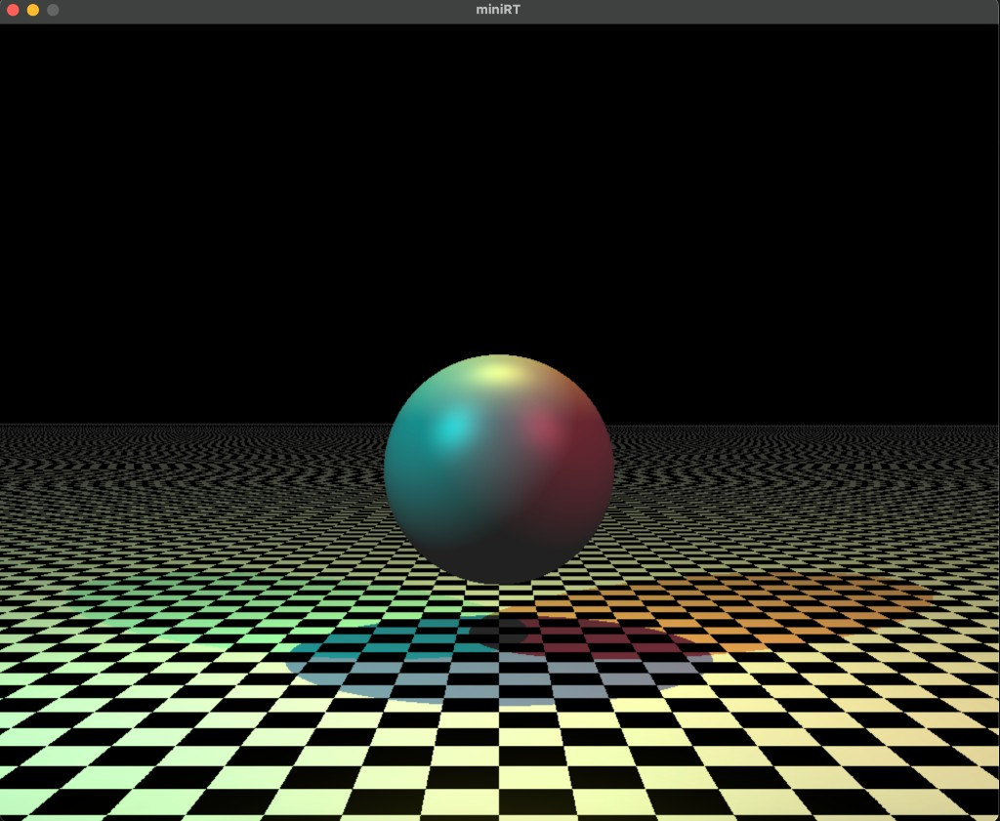
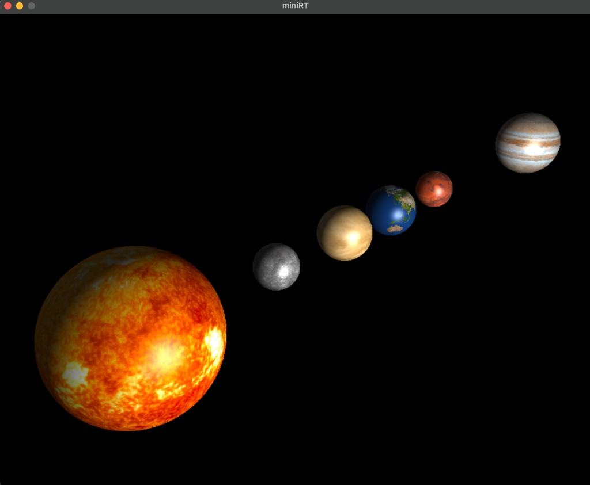
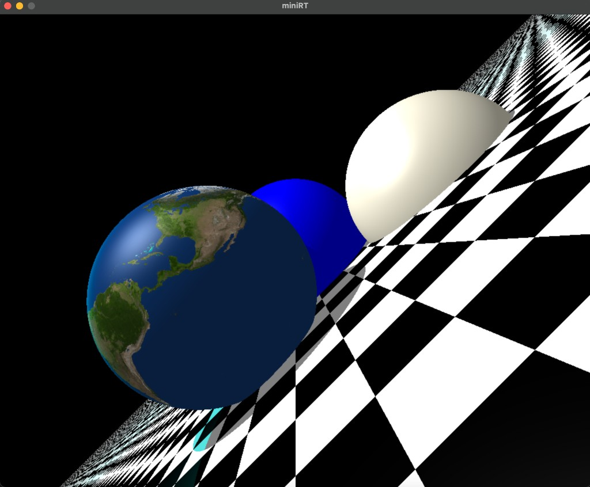

*This project has been created as part of the 42 curriculum by [alisharu], [vmakarya].*

## Description

`miniRT` is a small real-time ray tracer written in C.  
It parses a `.rt` scene description file, builds an in-memory representation of the scene, and renders it using basic ray-tracing techniques.

The project supports the following objects and features:
- **Primitives**: sphere (`sp`), plane (`pl`), cylinder (`cy`), cone (`co`)
- **Lights**: ambient light and point lights
- **Camera**: single perspective camera with configurable position, orientation, and field of view
- **Shading**: diffuse and specular lighting, shadows, and simple reflection of light and color
- **Checkerboard**: procedural checkerboard patterns for multiple primitives
- **Bump / texture**: simple bump/texture mapping for more detailed surfaces
- **Multithreading**: image rendering split across multiple threads for faster rendering on multi-core CPUs

The goal of the project is to introduce the fundamentals of ray tracing (rays, intersections, normals, lighting, shadows) while respecting the 42 Norm and working with `minilibx` on both macOS and Linux.

## Instructions

## Gallery

Below are some example renders produced by `miniRT`:










### Requirements

- **OS**: macOS or Linux
- **Compiler**: `cc` (or any C compiler compatible with `-Wall -Wextra -Werror`)
- **Libraries**:
  - `libft` (provided in `libs/libft`)
  - `minilibx` for macOS (`libs/minilibx_macos`) and Linux (`libs/minilibx-linux`)

Make sure the libraries are cloned/built in the `libs/` directory as expected by the `Makefile`.

### Compilation

In the project root:

```bash
make
```

This will:
- Build `libft`
- Build the appropriate `minilibx` (depending on the host OS)
- Compile all sources into `build/`
- Link the final executable `miniRT`

Useful targets:

- **Rebuild everything from scratch**:

  ```bash
  make fclean && make
  ```

- **Clean object files and library objects**:

  ```bash
  make clean
  ```

- **Full clean (objects + executable)**:

  ```bash
  make fclean
  ```

- **Norminette check**:

  ```bash
  make norm
  ```

### Running

`miniRT` takes one `.rt` scene file as argument:

```bash
./miniRT maps/one.rt
```

Other example scenes are available in the `maps/` directory, such as:

- `maps/mini.rt`
- `maps/cylinder.rt`
- `maps/cone.rt`
- `maps/room.rt`
- `maps/solar.rt`

You can pass any valid `.rt` file:

```bash
./miniRT maps/your_scene.rt
```

### Controls

(Adapt this list to your exact implementation.)

- **ESC / window close button**: quit the program and free resources
- **Arrows / WASD**: move camera position (if implemented)
- **Mouse**: look around / rotate camera (if implemented)

If some of these controls are not available in your version, they can be removed or adjusted here.

## Features

- **Mandatory features**
  - Parsing of a `.rt` scene file with:
    - Ambient light
    - One or more point lights
    - A single camera
    - Spheres, planes, cylinders, cones
  - Input validation with clear error messages
  - Vector math utilities and normalization helpers
  - Ray–object intersection routines for each primitive
  - Lighting (ambient + diffuse + specular) and shadow computation
  - Clean exit and resource deallocation

- **Implemented extras / bonus-style features**
  - **Cone primitive (`co`)**: intersection and normal computation for cones
  - **Multithreaded rendering**: the image is rendered using multiple threads to speed up computation (see `source/ray_tracing/thread/`)
  - **Checkerboard patterns**: procedural checkerboard for spheres, planes, cylinders, and cones
  - **Bump / texture mapping**: simple bump/texture effects for more interesting surfaces

If the official subject considers some of these features as bonuses, they can be evaluated as such, but they are fully integrated into this implementation.

## Resources

- Ray Tracing in One Weekend series by Peter Shirley → https://raytracing.github.io/
- Scratchapixel Ray-Tracing Lessons → https://www.scratchapixel.com/lessons/3d-basic-rendering/ray-tracing-rendering-a-triangle
- Phong Reflection Model explanation → https://en.wikipedia.org/wiki/Phong_reflection_model
- LearnOpenGL – Lighting Basics → https://learnopengl.com/Lighting/Basic-Lighting

### Ray tracing and graphics references

- **Ray Tracing in One Weekend** — Peter Shirley  
- **Scratchapixel 2.0** — Ray tracing and shading tutorials (`https://www.scratchapixel.com/`)
- **miniLibX documentation and examples** — basic windowing and image usage for 42 projects
- **LearnOpenGL (Lighting sections)** — concepts of diffuse/specular lighting and normals (`https://learnopengl.com/Lighting/Basic-Lighting`)
- Various articles and blog posts on:
  - Ray–sphere, ray–plane, ray–cylinder, and ray–cone intersection formulas
  - Multithreaded rendering patterns

### AI usage

AI tools (primarily Grok by xAI and occasionally ChatGPT) were used in the following ways:

- Explaining and verifying complex mathematical concepts (e.g., cone/cylinder intersection formulas, normal perturbation for bump mapping, reflection vectors)
- Debugging edge cases in parsing and floating-point comparisons
- Suggesting improvements to the cross-platform Makefile (macOS/Linux handling without forbidden constructs)
- Helping structure and improve the wording of this README.md file

**No production code was directly copied or generated by AI.**  
All intersection logic, shading calculations, threading implementation, parsing rules, and vector utilities were hand-written and thoroughly tested by the authors. AI served only as an educational and review tool — equivalent to consulting documentation or asking a peer.
